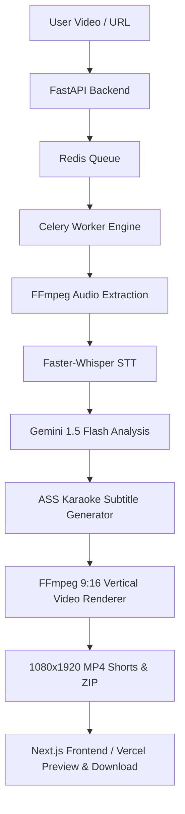

# ⚡ ViralCut — AI Video to Shorts Generator

[](https://nextjs.org/)
[](https://react.dev/)
[](https://fastapi.tiangolo.com/)
[](https://docs.celeryq.dev/)
[](https://redis.io/)
[](https://ai.google.dev/)
[](https://ffmpeg.org/)

**ViralCut** is an open-source, production-ready AI video repurposing platform. It transforms long-form videos (podcasts, YouTube interviews, keynotes, webinars) into high-retention 9:16 vertical Shorts, Reels, and TikToks with dynamic kinetic karaoke subtitles.

---

## 📐 Deployment Architecture & Infographic

```
                      +------------------------------------------+
                      |            DEVELOPER COMPUTER            |
                      |          d:\Viral Cut (Monorepo)         |
                      +--------------------+---------------------+
                                           |
                                      git push
                                           v
                      +--------------------+---------------------+
                      |             GITHUB REPOSITORY             |
                      |         github.com/user/ViralCut         |
                      +----+---------------+---------------+-----+
                           |               |               |
             Root: frontend/|  Root: backend/|  Root: agent/ |
                           v               v               v
               +-----------+---+   +-------+-------+   +---+-----------+
               |     VERCEL    |   | BACKEND HOST  |   | WORKER HOST   |
               |  (Next.js 16) |   | (FastAPI API) |   | (Celery+FFmpeg|
               |  Edge Network |   |  Web Service  |   | +Whisper+AI)  |
               +-------+-------+   +-------+-------+   +-------+-------+
                       |                   |                   |
                       |  REST API Calls   |   Enqueue Jobs    |
                       +------------------►+------------------►+
                                           |                   |
                                           |                   |
                               +-----------v-------------------v-----------+
                               |               REDIS CLOUD                 |
                               |  Task Broker & Real-Time Job Progress     |
                               +-------------------+-----------------------+
                                                   |
                             +---------------------+---------------------+
                             |                                           |
                             v                                           v
               +-------------+-------------+               +-------------+-------------+
               |      GOOGLE GEMINI API    |               |       CLOUDFLARE R2       |
               |   Transcript Viral Hook   |               |   S3 Object Storage for   |
               |   Scoring & Detection     |               |   Temporary & Final Shorts|
               +---------------------------+               +---------------------------+
```



---

## 🗂️ Clean Project Structure

```
ViralCut/
│
├── frontend/                     # Next.js 16 App Router Frontend
│   ├── src/                      # App, Components, Hooks, Lib, Types
│   ├── public/                   # Static assets & brand icons
│   ├── package.json              # Frontend Node dependencies
│   ├── package-lock.json         # Lockfile
│   ├── next.config.ts            # Turbopack & security header config
│   ├── tsconfig.json             # TypeScript 5 configuration
│   ├── postcss.config.mjs        # PostCSS / Tailwind v4 config
│   ├── components.json           # Shadcn UI config
│   └── .env.example              # Frontend environment template
│
├── backend/                      # FastAPI Python REST API Server
│   ├── app/                      # Main app, API routers, core settings, services
│   ├── requirements.txt          # Pinned backend dependencies
│   ├── run.py                    # Local Uvicorn server launcher
│   ├── Dockerfile                # Backend production container
│   └── .env.example              # Backend environment template
│
├── agent/                        # Celery Background Worker & AI Pipeline
│   ├── worker.py                 # Celery standalone worker launcher
│   ├── Dockerfile                # FFmpeg + Faster-Whisper + Celery container
│   ├── requirements.txt          # Worker dependencies
│   └── .env.example              # Worker environment template
│
├── docs/                         # In-Depth Documentation Suite
│   ├── ARCHITECTURE.md           # System architecture, data flow & security specs
│   ├── LOCAL-DEVELOPMENT.md      # Step-by-step local development guide
│   └── DEPLOYMENT.md             # Production deployment guides (Vercel, Render, R2)
│
├── legacy_prototype/             # [REVIEW REQUIRED] Preserved original prototype
│
├── docker-compose.yml            # Local Redis + Backend + Worker orchestration
├── .gitignore                    # Master root gitignore (GitHub & Vercel ready)
├── .env.example                  # Master environment variables reference
└── README.md                     # Master project guide
```

---

## 🚀 Quick Start: Local Development

### Prerequisites
- Node.js 18+ & Python 3.10+
- FFmpeg & FFprobe installed in PATH
- Redis server running on `localhost:6379`
- Google Gemini API key from [Google AI Studio](https://aistudio.google.com/app/apikey)

### 4-Terminal Startup

```powershell
# ── Terminal 1: Redis ──────────────────────────────────────────────────────────
docker run -p 6379:6379 --rm redis:alpine

# ── Terminal 2: FastAPI Backend ────────────────────────────────────────────────
cd backend
python -m venv venv
.\venv\Scripts\Activate.ps1
pip install -r requirements.txt
python run.py

# ── Terminal 3: Celery Background Worker ───────────────────────────────────────
cd backend
.\venv\Scripts\Activate.ps1
celery -A app.core.celery_app worker --loglevel=info --concurrency=2

# ── Terminal 4: Next.js Frontend ───────────────────────────────────────────────
cd frontend
npm install
npm run dev
```

Visit **`http://localhost:3000`** in your browser.

---

## 🌐 Production Deployment

Deploy the entire system from a single GitHub repository:

| Service | Platform | Root Directory | Build Command | Start Command |
| :--- | :--- | :--- | :--- | :--- |
| **Frontend Web UI** | **Vercel** | `frontend` | `npm run build` | Next.js default |
| **FastAPI Backend** | **Render / Railway** | `backend` | `pip install -r requirements.txt` | `uvicorn app.main:app --host 0.0.0.0 --port $PORT` |
| **AI Worker Engine** | **Render / Docker** | `.` or `agent` | Dockerfile (`agent/Dockerfile`) | `celery -A app.core.celery_app worker --loglevel=info -c 2` |
| **Message Broker** | **Redis Cloud / Upstash**| — | Managed Service | `rediss://...` |
| **Object Storage** | **Cloudflare R2** | — | Managed S3-compatible | `https://*.r2.cloudflarestorage.com` |

---

## 🔐 Environment Variables

Copy `.env.example` to `.env` or set in your cloud provider dashboards:

```ini
# Frontend (Vercel)
NEXT_PUBLIC_API_URL=https://api.yourdomain.com

# Backend & Worker (Render / Railway / VPS)
PROJECT_NAME="ViralCut Backend"
REDIS_URL=redis://localhost:6379/0
CELERY_BROKER_URL=redis://localhost:6379/0
CELERY_RESULT_BACKEND=redis://localhost:6379/0
GEMINI_API_KEY=your_gemini_api_key_here
GEMINI_MODEL=gemini-1.5-flash
WHISPER_MODEL_SIZE=base
WHISPER_DEVICE=auto
ALLOWED_CORS_ORIGINS=["https://yourdomain.com"]

# Cloudflare R2 (Server-side Only)
CLOUDFLARE_ACCOUNT_ID=your_account_id
R2_ACCESS_KEY_ID=your_access_key
R2_SECRET_ACCESS_KEY=your_secret_key
R2_BUCKET_NAME=viralcut-storage
R2_ENDPOINT_URL=https://your_account_id.r2.cloudflarestorage.com
R2_PUBLIC_DOMAIN=https://pub-viralcut.r2.dev
```

---

## 🛡️ Security Features
- **SSRF Defense**: Strict validation rejecting RFC-1918 private IPs (`10.0.0.0/8`, `172.16.0.0/12`, `192.168.0.0/16`, `127.0.0.0/8`, `169.254.0.0/16`) and internal TLDs.
- **MIME Magic Byte Validation**: Inspects binary headers to reject disguised file payloads.
- **Resource Limits**: Configurable worker time limits (600s hard, 540s soft), sliding-window rate limiting, and process recycling.
- **24-Hour Anonymous Storage**: Automatically purges temporary uploads and generated clips after 24 hours.

---

## 🧪 Testing

Run backend test suites:
```powershell
cd backend
python -m unittest test_security.py
python -m unittest test_feasibility.py
python -m unittest test_gemini.py
python -m unittest test_clip_generation.py
```

Test frontend compilation:
```powershell
cd frontend
npm run build
```

---

## 📄 License
MIT License. Built for creators and developers worldwide.
