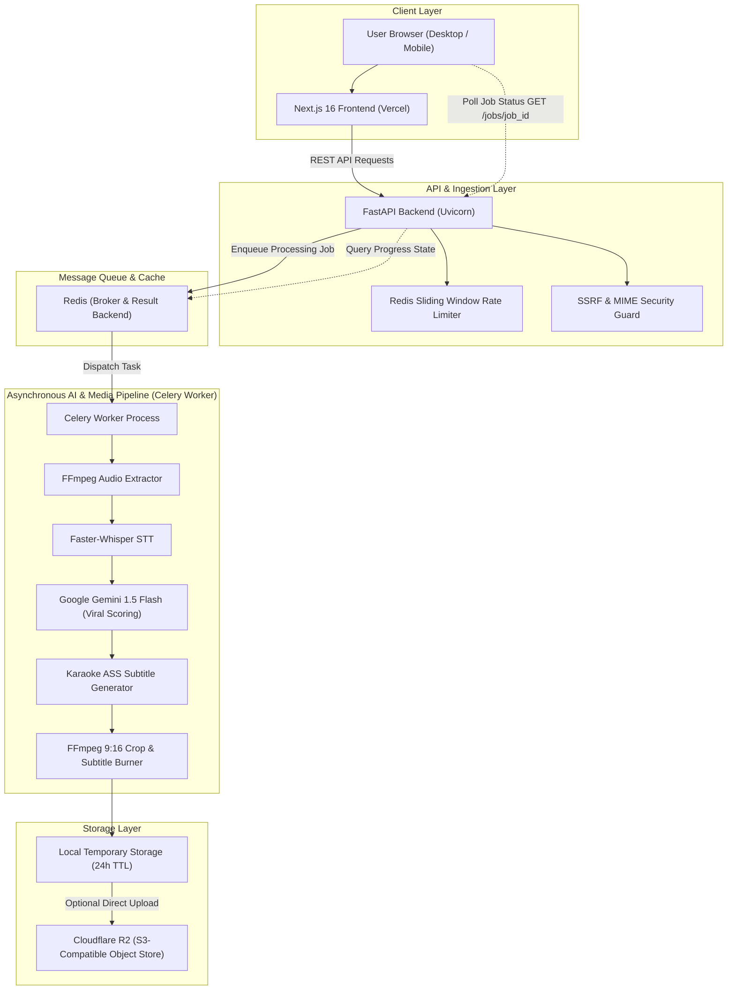
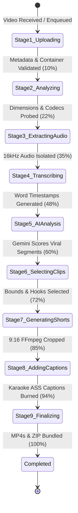

# ViralCut System Architecture

ViralCut is an AI-powered automated video repurposing engine that transforms long-form video content (podcasts, tutorials, interviews, keynotes) into high-retention 9:16 vertical Shorts with animated kinetic karaoke subtitles.

---

## High-Level System Architecture Diagram

---

## Core Components

### 1. Frontend (`frontend/`)
- **Technology**: Next.js 16.3 (App Router), React 19, TypeScript 5, Tailwind CSS v4, Lucide React.
- **Role**: Client UI for video upload, URL submission, real-time polling progress feedback, interactive video player modal, caption customization, and one-click ZIP downloads.
- **Deployment**: Vercel (Edge network).

### 2. Backend API (`backend/`)
- **Technology**: FastAPI, Uvicorn, Pydantic v2.
- **Role**:
  - Validates incoming video uploads (magic byte MIME checks, file size validation).
  - Validates input URLs (SSRF protection blocking RFC-1918 private subnets and internal TLDs).
  - Enqueues asynchronous Celery tasks.
  - Exposes polling endpoints (`/api/v1/jobs/{job_id}`) and download streaming.
- **Deployment**: Render Web Service, Railway, Docker, or VPS.

### 3. Background Processing Agent (`agent/` + `backend/app/tasks.py`)
- **Technology**: Celery, Faster-Whisper, Google Gemini 1.5 Flash, FFmpeg, FFprobe.
- **Role**:
  - **Audio Extraction**: Converts input video audio to 16kHz WAV.
  - **Speech Transcription**: Extracts word-level timestamped tokens with Faster-Whisper.
  - **Viral Analysis**: Formats normalized transcript and prompts Gemini 1.5 Flash to identify hook moments, emotional spikes, and viral segment bounds.
  - **Video Transformation**: Cuts segment bounds, centers crop to 9:16 vertical ratio, builds animated karaoke style `.ass` subtitles, and burns captions into 1080×1920 MP4 outputs.
- **Deployment**: Render Background Worker, Railway Service, Docker, or GPU/CPU VPS.

### 4. Message Queue & Cache
- **Technology**: Redis 7.
- **Role**: Celery task queue message broker, real-time job progress state repository, sliding-window IP rate limiter.

---

## Video Processing State Machine (9 Stages)

---

## Security Architecture

1. **SSRF Guard**:
   - Every external URL submitted for download is resolved to an IP address before establishing connections.
   - Any URL resolving to private ranges (`10.0.0.0/8`, `172.16.0.0/12`, `192.168.0.0/16`, `127.0.0.0/8`, `169.254.0.0/16`) or internal TLDs (`.local`, `.internal`, `.localhost`) is immediately rejected.
2. **Magic Byte MIME Validation**:
   - File uploads are validated via file header magic bytes rather than trusting spoofable client-provided file extensions.
3. **Path Traversal Protection**:
   - All uploaded filenames and job IDs are sanitized using strict UUIDs, preventing directory traversal attacks.
4. **Worker Resource Protections**:
   - Celery tasks have hard timeouts (600s) and soft timeouts (540s).
   - Worker processes are recycled after 20 tasks or 500 MB memory consumption to prevent memory leaks from FFmpeg / PyTorch.
5. **Anonymous 24-Hour Storage Policy**:
   - Temporary videos are stored with 24-hour expiration lifecycles and purged automatically.
